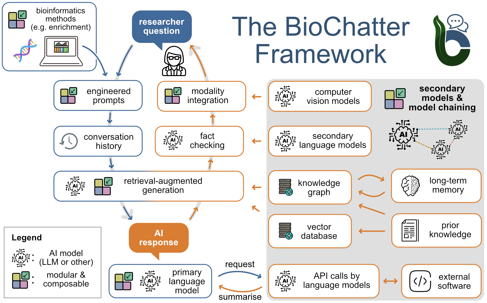

[//]: # (TODO: Add a documentation page dedicated to the native integration with BioChatter, use as a reference the info at the end of this page https://biocypher.org/#connect-your-knowledge-graph-to-large-language-models)

# BioChatter (LLM on Knowledge Graphs)

## Connect your Knowledge Graph to Large Language Models

To facilitate the use of knowledge graphs in downstream tasks, we have developed a framework to connect knowledge graphs to large language models, this framework is called [BioChatter](https://biochatter.org/)

biochatter is a Python package implementing a generic backend library for the connection of biomedical applications to conversational AI. We describe the framework in this [preprint](https://arxiv.org/abs/2305.06488). BioChatter is part of the BioCypher ecosystem, connecting natively to BioCypher knowledge graphs.

### BioCypher Ecosystem (BioCypher + BioChatter)

