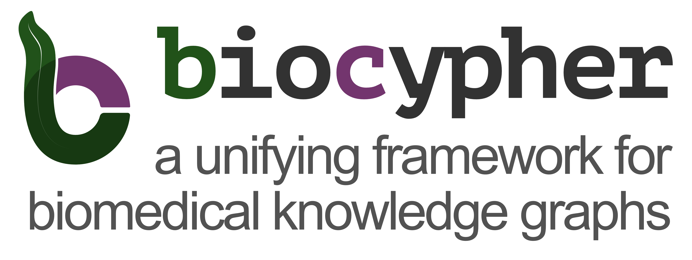

## Mission Statement

We aim to **enable access to versatile and powerful knowledge graphs for as many researchers as possible**. Making biomedical knowledge “their own” is often a privilege of the companies and groups that can afford individuals or teams working on knowledge representation in a dedicated manner. With BioCypher, we aim to change that. Creating a knowledge graph should be “as simple as possible, but not any simpler.” To achieve this, we have developed a framework that facilitates the creation of knowledge graphs that are informed by the latest developments in the field of biomedical knowledge representation. However, to make this framework truly accessible and comprehensive, we need the input of the biomedical community. We are therefore inviting you to join us in this endeavour!

## Vision Statement

The machine learning models we train are only as good as the data they are trained on. However, most developments today still rely on manually engineered and non-reproducible data processing. We envision a future where the creation of knowledge graphs is as easy as running a script, enabling researchers to build reliable knowledge representations with up-to-date information. We believe that making the knowledge representation process more agile and lifting it to the same level of attention as the process of algorithm development will lead to more robust and reliable machine learning models. We are convinced that this will be a crucial step towards the democratization of AI in biomedicine and beyond.

## Project Timeline

  <h3>January 2024</h3>
  
<strong>Project Kickoff</strong>: Defined project goals and gathered the team.

  <h3>February 2024</h3>
  
<strong>Design Phase</strong>: Initial design prototypes were created.

  <h3>March 2024</h3>
  
<strong>Development Begins</strong>: Core development started, focusing on main features.

  <h3>January 2025</h3>
  
<strong>Beta Testing</strong>: Released the first beta version to select users.

  <h3>March 2025</h3>
  
<strong>Official Launch</strong>: Publicly launched the final version.

